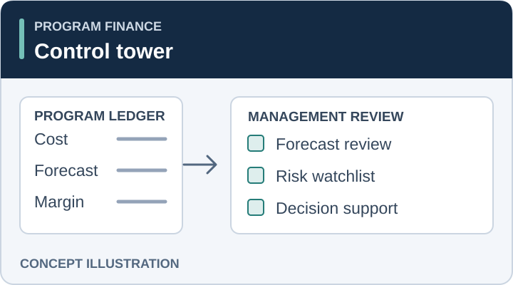
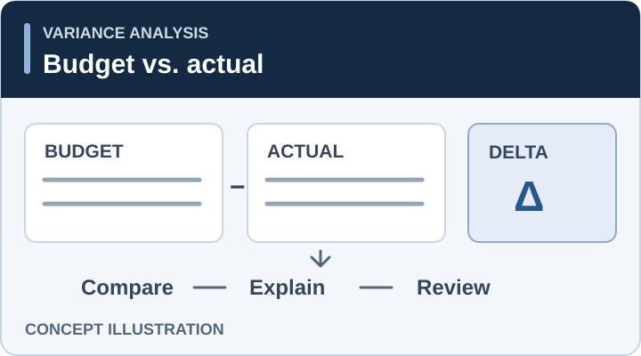
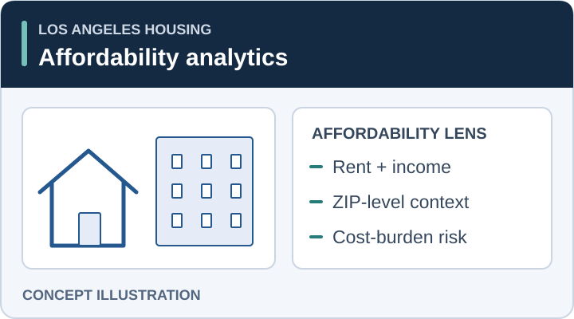
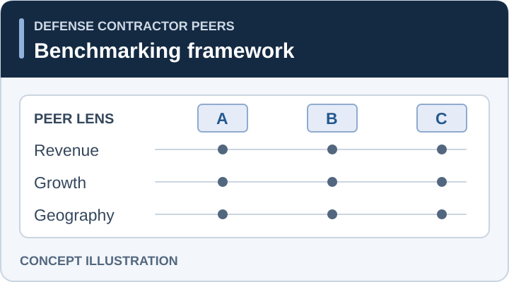

# Jeffrey Morales

### Finance Systems · Data Analytics · FP&A · Applied Statistics

Turning financial and operational data into clear analysis, decision support, and reproducible reporting.

  
  
  
  
  

  <a href="#featured-work"><strong>Featured Work</strong></a>
  &nbsp;·&nbsp;
  <a href="#analytics--statistics"><strong>Analytics & Statistics</strong></a>
  &nbsp;·&nbsp;
  <a href="docs/README.md"><strong>Repository Guide</strong></a>
  &nbsp;·&nbsp;
  <a href="docs/RUNNING_PROJECTS.md"><strong>How to Run</strong></a>

---

> **Portfolio status — Active & evolving.** Projects are continuously refined for clearer documentation, stronger reproducibility, cleaner presentation, and better decision-focused storytelling.

## ✦ Welcome

This repository is the central home for my work across **finance, forecasting, data analysis, statistical modeling, and automation**. It is designed for quick review by hiring managers, collaborators, and anyone interested in how I translate data into useful decisions.

<table>
<tr>
<td align="center" width="25%"><strong>97.5%</strong> FP&A forecast accuracy</td>
<td align="center" width="25%"><strong>0.9498</strong> LA Housing ROC-AUC</td>
<td align="center" width="25%"><strong>100</strong> Companies benchmarked</td>
<td align="center" width="25%"><strong>10</strong> Finance workstreams reviewed</td>
</tr>
</table>

---

## ⭐ Featured Work

<table>
<tr>
<td width="50%" valign="top">

### 📊 Program Finance Control Tower

**Program finance · Forecast review · Management reporting**

A finance control view built to identify workstreams requiring leadership attention and forecast review.

**Highlights**
- 10 workstreams reviewed
- 3 management watchlist items
- EAC, ETC, CPI, margin, and risk metrics

**[Explore project →](Program-Finance-Control-Tower/README.md)**

</td>
<td width="50%" valign="top">

### 📈 Budget vs. Actual FP&A

**FP&A · Variance analysis · Forecast accuracy**

A management reporting package that turns budget and actual expense data into clear variance drivers and forecast-review signals.

**Highlights**
- 97.5% forecast accuracy
- -2.5% net scenario variance
- Materiality and account-level drilldowns

**[Explore project →](Budget-vs-Actual-FPA-Variance-Analysis/README.md)**

</td>
</tr>

<tr>
<td width="50%" valign="top">

### 🏙️ LA Housing Affordability Forecasting

**Data science · Public data · Predictive modeling**

A Los Angeles County affordability analysis using public rent and income data to model future cost-burden risk.

**Highlights**
- 1,248 ZIP-year observations
- 212 LA County ZIP codes
- 0.9498 ROC-AUC

**[Explore project →](LA-Housing-Affordability-Forecasting/README.md)**

</td>
<td width="50%" valign="top">

### 🛰️ Defense Contractor Peer Benchmarking

**Strategic finance · Benchmarking · Scenario planning**

A peer-analysis model covering estimated category revenue, concentration, geography, CAGR, and long-range planning scenarios.

**Highlights**
- 100 companies benchmarked
- 36.1% top-five concentration
- Peer-growth planning references

**[Explore project →](Defense-Contractor-Peer-Benchmarking/README.md)**

</td>
</tr>
</table>

---

## 💼 Finance & Decision Support

<table>
<tr>
<td align="center"><strong>Program Controls</strong> EAC · ETC · CPI · Margin</td>
<td align="center"><strong>FP&A</strong> Budget · Actuals · Variance</td>
<td align="center"><strong>Strategic Finance</strong> Benchmarking · CAGR · Scenarios</td>
<td align="center"><strong>Decision Support</strong> KPIs · Watchlists · Executive summaries</td>
</tr>
</table>

The finance projects emphasize **management usefulness**, not just calculation: identifying what changed, why it matters, and what deserves attention next.

---

## 🧪 Analytics & Statistics

<table>
<tr>
<td width="33%" valign="top">

### 📐 Linear Regression

Historical empirical results are clearly separated from a runnable synthetic demonstration, with explicit reproducibility and provenance controls.

**[Height-Weight Regression →](Height-Weight-Linear-Regression/README.md)**

</td>
<td width="33%" valign="top">

### ☕ Hypothesis Testing

A statistical inference project demonstrating one-sample testing, decision rules, uncertainty, and plain-language interpretation.

**[Caffeine Hypothesis Test →](Caffeine-Hypothesis-Test/README.md)**

</td>
<td width="33%" valign="top">

### 🪙 Bayesian Updating

A compact Bayesian project using a Beta prior, simulated observations, and posterior inference to show how evidence changes probability estimates.

**[Bayesian Coin Flipping →](Binomial-Coin-Flipping/README.md)**

</td>
</tr>
</table>

---

## 🧰 Toolkit

---

## ✨ What This Portfolio Emphasizes

| | Capability | Portfolio evidence |
|---|---|---|
| 💰 | **Financial analysis** | Budget variance, program controls, forecast review, peer benchmarking |
| 🎯 | **Decision support** | KPI scorecards, management watchlists, executive summaries |
| 🧹 | **Data analysis** | Cleaning, reshaping, aggregation, diagnostics, reproducible pipelines |
| 📊 | **Statistical modeling** | Regression, classification, hypothesis testing, Bayesian updating |
| 🗣️ | **Communication** | Business framing, limitations, source notes, concise interpretation |
| ✅ | **Reproducibility** | Data provenance notes, runnable code paths, automated repository validation |

---

## 🗂️ Repository Guide

<table>
<tr>
<td width="50%" valign="top">

### Documentation

- **[Documentation index](docs/README.md)**
- **[Dataset notes](docs/DATASETS.md)**
- **[KPI guide](docs/KPI_GUIDE.md)**

</td>
<td width="50%" valign="top">

### Run & Review

- **[Running the projects](docs/RUNNING_PROJECTS.md)**
- **[Finance project index](docs/FINANCE_PROJECTS.md)**
- **[Portfolio validation workflow](.github/workflows/portfolio-validation.yml)**

</td>
</tr>
</table>

---

<strong>🔎 Quality & validation</strong>

 

This repository uses GitHub Actions to validate:

- Python compilation
- critical lint errors
- non-blocking style findings
- Jupyter notebook structure
- pytest tests when test files are present

 

### Thanks for visiting 👋

<strong>Start with the featured projects above.</strong>

Built as an evolving portfolio of finance, analytics, and applied data work.

